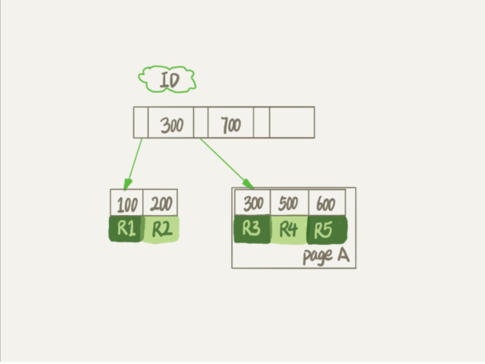


# mysql 删除表数据，表文件大小不变
---
某日线上环境mysql所在服务器空间不够，接到运维报警后，我决定删除其中一个bi统计表的数据，该表占用空间100g,但bi只需要保留最近一个月的数据就可以，于是执行delete 命令，
删除一个月之前的数据，
```
delete from db.table t where create_time > '2020-01-01';
```
删完数据之后，发现磁盘空间仍然报警，跟bi确认之后，直接truncate 命令删除并重建，报警解除。之后开始查找这个问题出现的原因，发现是这样的：

一个 InnoDB 表包含两部分，即：表结构定义和数据。在 MySQL 8.0 版本以前，表结构是存在以.frm 为后缀的文件里。而 MySQL 8.0 版本，则已经允许把表结构定义放在系统数据表中了。
表数据既可以存在共享表空间里，也可以是单独的文件。这个行为是由参数 innodb_file_per_table 控制的：

    这个参数设置为 OFF 表示的是，表的数据放在系统共享表空间，也就是跟数据字典放在一起；

    这个参数设置为 ON 表示的是，每个 InnoDB 表数据存储在一个以 .ibd 为后缀的文件中。

从 MySQL 5.6.6 版本开始，它的默认值就是 ON 了。不论使用 MySQL 的哪个版本，都建议将这个值设置为 ON。因为，一个表单独存储为一个文件更容易管理，而且在你不需要这个表的时候，
通过 drop table 命令，系统就会直接删除这个文件。而如果是放在共享表空间中，即使表删掉了，空间也是不会回收的。所以，将 innodb_file_per_table 设置为 ON，是推荐做法，
我们接下来的讨论都是基于这个设置展开的。
数据删除流程
我们知道，mysql的数据是以B+树的结构组织的，以下图为例

假设，我们要删掉 R4 这个记录，InnoDB 引擎只会把 R4 这个记录标记为删除。如果之后要再插入一个 ID 在 300 和 600 之间的记录时，可能会复用这个位置。但是，磁盘文件的大小并不会缩小。

现在，你已经知道了 InnoDB 的数据是按页存储的，那么如果我们删掉了一个数据页上的所有记录，会怎么样？

答案是，整个数据页就可以被复用了。delete 命令其实只是把记录的位置，或者数据页标记为了“可复用”，但磁盘文件的大小是不会变的。也就是说，通过 delete 命令是不能回收表空间的。
这些可以复用，而没有被使用的空间，看起来就像是“空洞”。如果要消除这些空洞，就需要重建表了。

重建表
试想一下，如果你现在有一个表 A，需要做空间收缩，为了把表中存在的空洞去掉，你可以怎么做呢？

你可以新建一个与表 A 结构相同的表 B，然后按照主键 ID 递增的顺序，把数据一行一行地从表 A 里读出来再插入到表 B 中。

由于表 B 是新建的表，所以表 A 主键索引上的空洞，在表 B 中就都不存在了。显然地，表 B 的主键索引更紧凑，数据页的利用率也更高。如果我们把表 B 作为临时表，数据从表 A 导入表 B 的操作完成后，
用表 B 替换 A，从效果上看，就起到了收缩表 A 空间的作用。
这里，你可以使用 alter table A engine=InnoDB 命令来重建表。在 MySQL 5.5 版本之前，这个命令的执行流程跟我们前面描述的差不多，区别只是这个临时表 B 不需要你自己创建，
MySQL 会自动完成转存数据、交换表名、删除旧表的操作。optimize也会达到同样的效果，mysql 官方建议，对于写比较频烦的表，要定期进行optimize，一个月一次，看实际情况而定了

至此，才了解了这个问题产生的原因，下次就不至于傻乎乎的去delete表了，而是在delete之后，再optimize一下，就可以解决问题了


